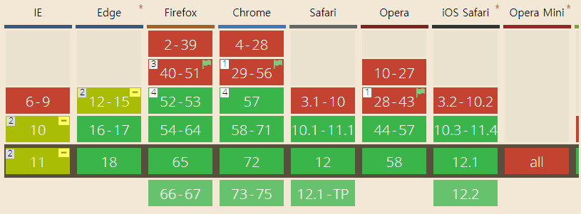
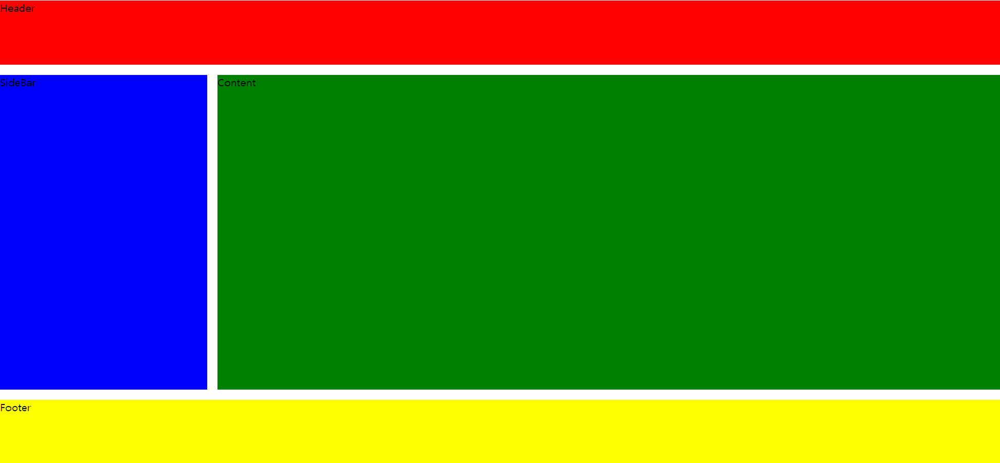

# Grid Layout
### 지원 브라우저
(https://caniuse.com/#feat=css-grid)
### 기본 레이아웃 구조

### CSS 코드
```css
.container{
	display:grid; /* grid 사용 알림 */
	grid-template-columns: 1fr 1fr 4fr 4fr; /* fraction 숫자 비율로 크기를 차지 */
	grid-template-rows: 100px 1fr 100px; /* 헤더 크기 100px, 남은 크기  ,푸터 크기 100px */
	grid-template-areas: 
	"header header header header"
	"sidebar sidebar content content"
	"footer footer footer footer";
	height: 100vh; /* 높이 100% */
	grid-gap: 1rem;
}

.header{
	background-color: red;
	grid-area: header; /* container에서 사용할 변수명 */
}

.sidebar{
	background-color: blue;
	grid-area:sidebar; /* container에서 사용할 변수명 */
}
.content{
	background-color: green;
	grid-area: content; /* container에서 사용할 변수명 */

}

.footer{
	background-color: yellow;
	grid-area: footer; /* container에서 사용할 변수명 */
}
```

